# Deploying Airflow to the Cloud

This lab will borrow heavily from the post [A simple guide to start using Apache Airflow 2 on Google Cloud](https://medium.com/apache-airflow/a-simple-guide-to-start-using-apache-airflow-2-on-google-cloud-1811c2127445). There are a few places (listed below) where this lab diverges from the original article. Refer to the original article for more detail, but keep these divergences in mind.

| Original Article | Lab 07 |
|------------------|--------|
| Gives service account access to BigQuery and [Dataflow](https://cloud.google.com/dataflow/) | Gives service account access to BigQuery and Cloud Storage |
| Uses default `SequentialExecutor` and SQLite DB | Uses `LocalExecutor` and Cloud SQL DB |
| Installs miniconda | Elects to not use an environment manager

## Deploying Apache Airflow

As a first step, you will need a repository that contains your Airflow files (DAGs, plugins, etc.). You can fork this repository, or start from your own.

### 1. Create a [Service Account](https://cloud.google.com/iam/docs/service-accounts)

You’ll need to create a Service Account, so your Airflow instance can access the different GCP services in your project.

First, go to IAM & Admin then Service Accounts, either by accessing it through the GCP menu, or by searching in the search box. Unlike before when we created a service account that had access to all resources in your GCP account, we are going to limit the resources this account has access to.

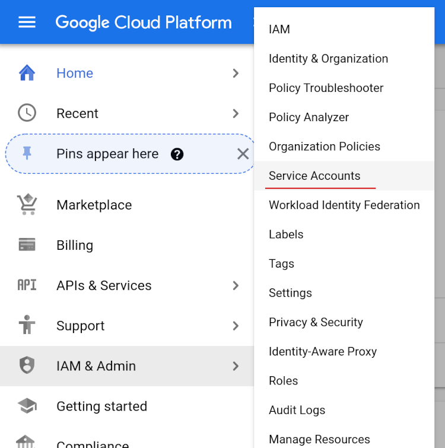

Name your service account something recognizable, and give it a description.

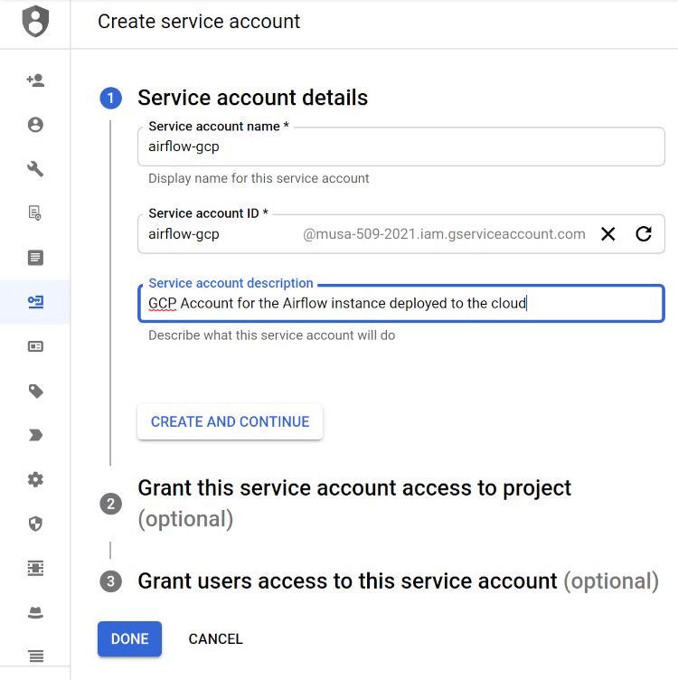

Give the service account access to run BigQuery jobs (**BigQuery Job User**), and to read and write files ("objects") from Google Cloud Storage (**Storage Object Creator** and **Storage Object Viewer**)

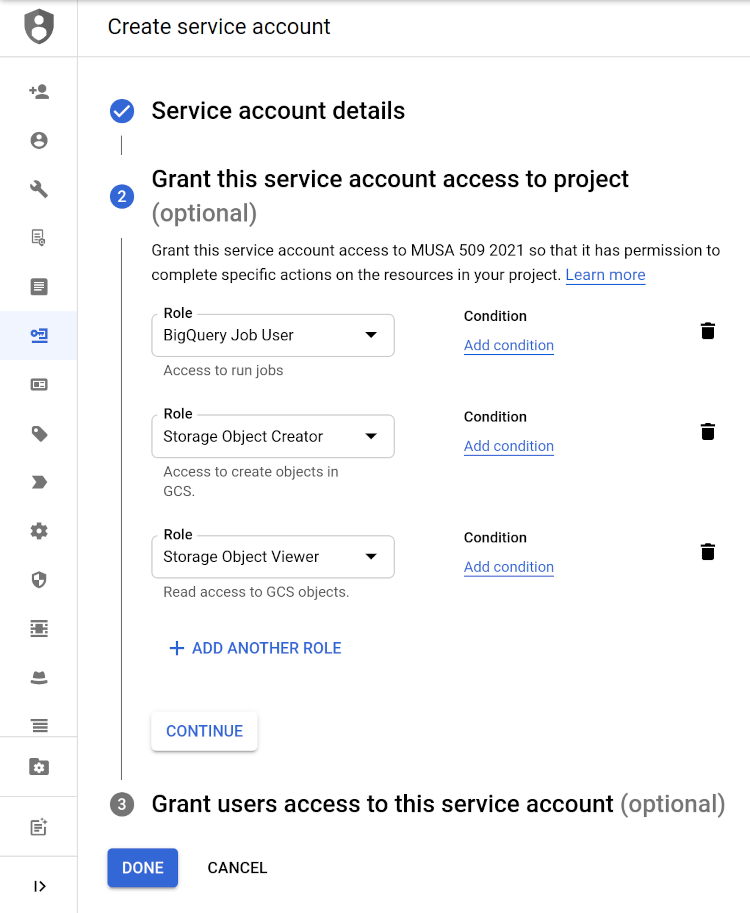

Click **DONE**, and then click on the email address for the newly created service account. Go to the **KEYS** heading and create a new key in JSON format.

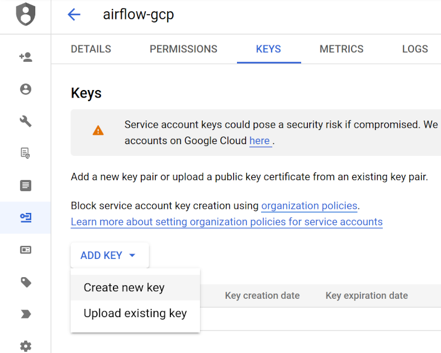

### 2. Create a Compute Engine instance

Deploy an instance with a sensible name (mine is `airflow-compute-instance`).

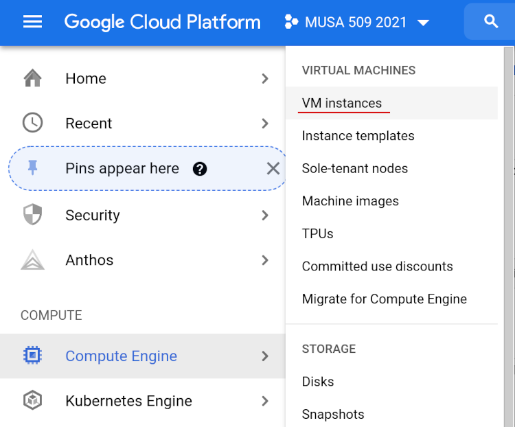

Set the minimum requirements for this case:
* `e2-micro` machine type (2vCPU, 1GB memory)
  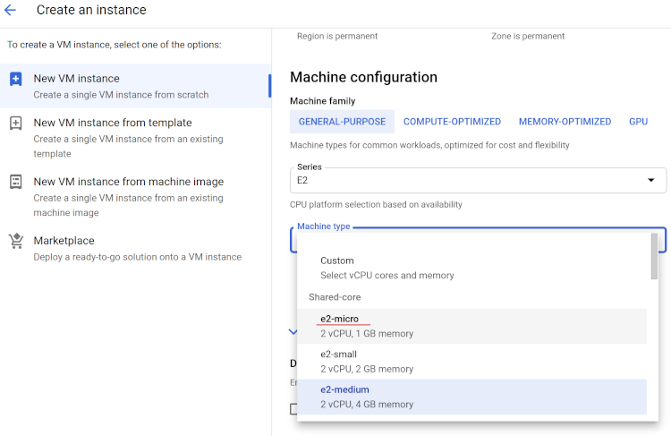
* Debian 10 (default -- nothing to change)
* 10 GB HDD (default -- nothing to change)

Additionally, choose the service account that you created in the previous step, and allow HTTPS and HTTP traffic and select the Service Account created

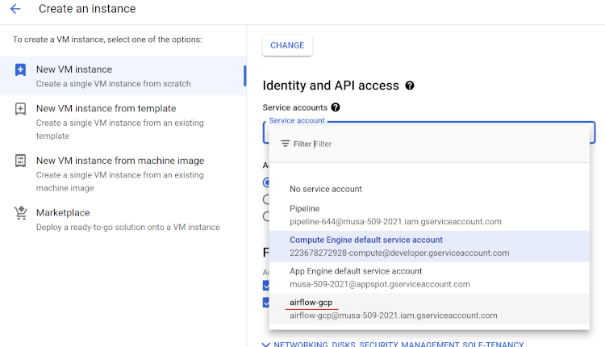

### 3. Create a cloud-hosted PostgreSQL instance

Browse to SQL in the main GCP menu.

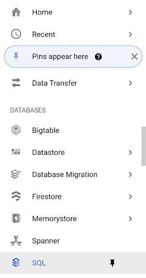

Create a new PostgreSQL database. Give it a sensible name, and specify that it should only be available in a **Single zone**. You will provide a password as well. Make sure to note this password somewhere (you can regenerate a password later, but easier to keep track of it in the first place).

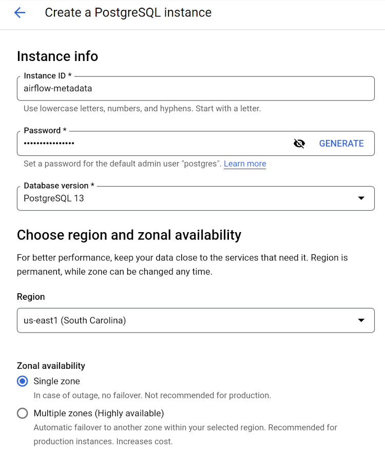

Because this is going to be a very light-weight instance, under storage select HDD and limit the size to 10GB, disabling automatic storage increases. Even with these settings, the database is going to run about $9/month.

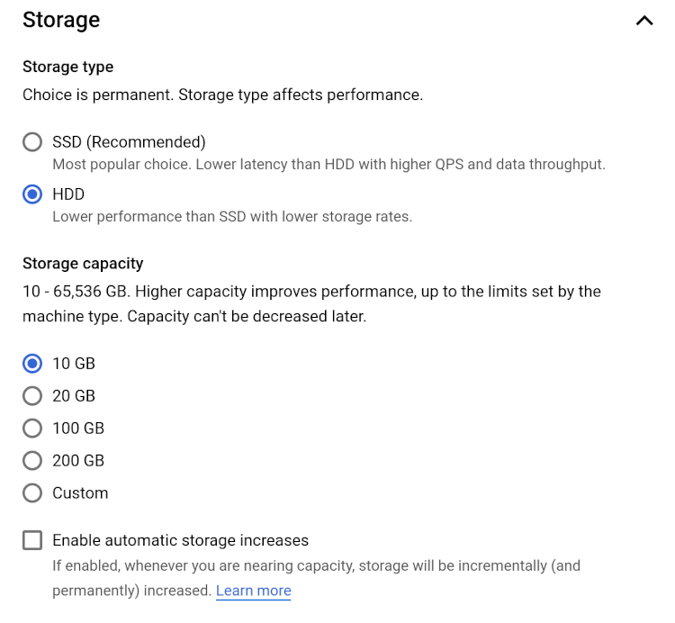

Finally, under the **Connection** settings, ensure that you have a **Private IP** selected. Choose **default** as the associated network. ou may be prompted to enable an additional service. This is ok.

### 4. Install Airflow

Head back over to the virtual machine you created. On the console click on SSH to start a terminal.

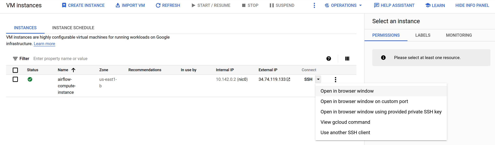

On the terminal let's install Python and update the catalog of available packages. **Note that you may have to paste these commands one at a time if using the GCP online terminal. Also note that the `\` characters at the end of the lines mean that the command is continued on the next line.**

```bash
sudo apt update
sudo apt -y upgrade
sudo apt install -y python3-pip \
    git \
    libpq-dev \
    linux-headers-$(uname -r)
sudo pip3 install --upgrade pip
```

We will be installing a few things that we can run (such as the `airflow` command) into a folder named _~/.local/bin/_, so we want to make sure that the computer knows to look here for files that we can run ("executable" files). Run this in the terminal:

```bash
echo 'export PATH=$PATH:$HOME/.local/bin' >> ~/.bashrc
source ~/.bashrc
```

Next, [Install Airflow](https://airflow.apache.org/docs/apache-airflow/stable/installation/index.html#using-pypi) and extra libraries onto the virtual machine.

```bash
pip install \
    requests \
    pandas \
    google-cloud-storage \
    SQLAlchemy[postgresql_psycopg2binary] \
    sqlalchemy-bigquery \
    google-cloud-bigquery-storage \
    "python-dotenv" \
    "apache-airflow[google]==2.2.1" \
    --constraint "https://raw.githubusercontent.com/apache/airflow/constraints-2.2.1/constraints-$(python3 -V | cut -d' ' -f2 | cut -d'.' -f1,2).txt"
```

To check whether the installation was successful, you can run:

```bash
airflow version
```

You should see `2.2.1`. Great.

Next we'll download our code to the machine using `git`. Find the HTTPS URL for your repository through the GitHub interface.

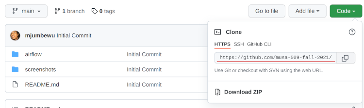

**In the following snippet I use my repository's URL, but yours will be different.**

```bash
git clone https://github.com/musa-509-fall-2021/lab-07-airflow-in-the-cloud.git
```

Finally we're going to create a shell script named _env.sh_ that will contain our environment variables, both for configuring Airflow and for configuring our pipeline. In the following block,
* the `ln` command creates an alias (a "link") to whatever folder contains our DAGs and plugins -- for me, that's a folder called _airflow/_ inside of my repository

  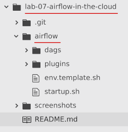
* the `cp` command copies the file named _env.template.sh_ to a new file named _env.sh_
* the `nano` command opens up an editor called Nano so that we can edit the file.

```bash
ln -s $HOME/lab-07-airflow-in-the-cloud/airflow airflow
cp $HOME/airflow/env.template.sh $HOME/airflow/env.sh
nano $HOME/airflow/env.sh
```

Paste the following contents into the file. Note that you will need to edit some of the values for your specific set up (specifically, the `AIRFLOW_DB_...` variables need to be set with values for your metadata database, and the `PIPELINE_...` variables need to point to resources in your GCP project).

```bash
# Airflow configuration vars
export AIRFLOW_HOME=$HOME/airflow
export AIRFLOW_DB_PASSWORD='...'
export AIRFLOW_DB_IPADDR='...'
export AIRFLOW__CORE__EXECUTOR=LocalExecutor
export AIRFLOW__CORE__PARALLELISM=1
export AIRFLOW__CORE__SQL_ALCHEMY_CONN=postgresql+psycopg2://postgres:${AIRFLOW_DB_PASSWORD}@${AIRFLOW_DB_IPADDR}/postgres
export AIRFLOW__CORE__FERNET_KEY=''
export AIRFLOW__CORE__DAGS_ARE_PAUSED_AT_CREATION='true'
export AIRFLOW__CORE__LOAD_EXAMPLES='false'
export AIRFLOW__WEBSERVER__WORKERS=3
export AIRFLOW__API__AUTH_BACKEND='airflow.api.auth.backend.basic_auth'

# Pipeline script vars
export PIPELINE_PROJECT='...'
export PIPELINE_DATA_BUCKET='...'
export PIPELINE_DATASET='...'
export GOOGLE_APPLICATION_CREDENTIALS=${HOME}/google-app-creds.json
```

> **Note:** The Airflow configuration variables I chose to set above are documented at [here](https://airflow.apache.org/docs/apache-airflow/stable/configurations-ref.html).

To exit the Nano editor, press **ctrl+x**. When it asks if you want to "_Save modified buffer?_", press **y** for yes. When it prompts you for the "_File Name to Write:_", just press **enter** to accept the default.

Run the following commands in the terminal. In the following code block:
* the `echo` command tells the operating system to load the script when a session starts (e.g., when the machine starts up, or when someone logs in to the machine via SSH), and
* the `source` command loads the _env.sh_ script into our current session (we do this instead of having to restart the terminal for it to take effect).

```bash
echo "source $HOME/airflow/env.sh" >> ~/.bashrc
source $HOME/airflow/env.sh
```

### 5. Set up the database

Only once, you need to initialize your metadata database and register at least one admin user. Make up a strong password for your airflow user, since this instance will be exposed to the general internet (**replace values for _mypassword_, _example@mail.com_, _yourname_, and _lastname_ with your own values**). I recommend https://passwordsgenerator.net/.

```bash
airflow db init
airflow users create -r Admin -u airflow -p 'mypassword' -e 'example@mail.com' -f 'yourname' -l 'lastname'
```

### 6. Configure network access

We need to allow access from our IP address to port 8080. We could be specific and only allow the IP address we're coming from (or others like it) -- e.g., [search Google for "what's my IP address"](https://www.google.com/search?q=whats+my+ip+address&oq=whats+my+ip+address) -- but instead we're going to allow all incoming traffit by specifying 0.0.0.0/0.

Go to Firewall/Create Firewall Rule

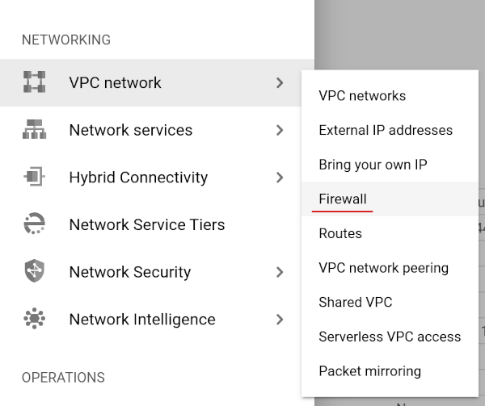

Create a firewall rule called `airflow-port` rule

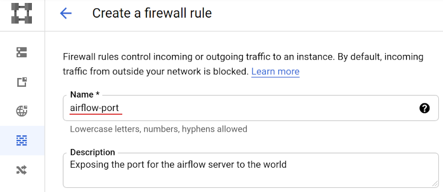

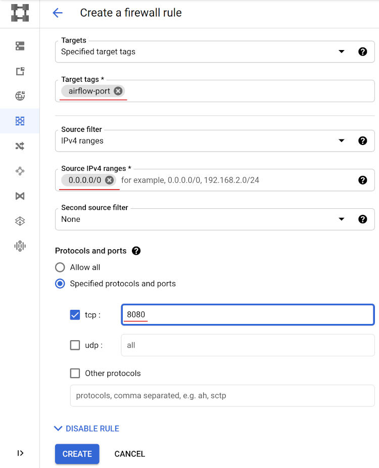

Go to Compute Engine/VM instances and click on your compute instance.

Edit the instance and apply the firewall rule by adding a **Network tag**

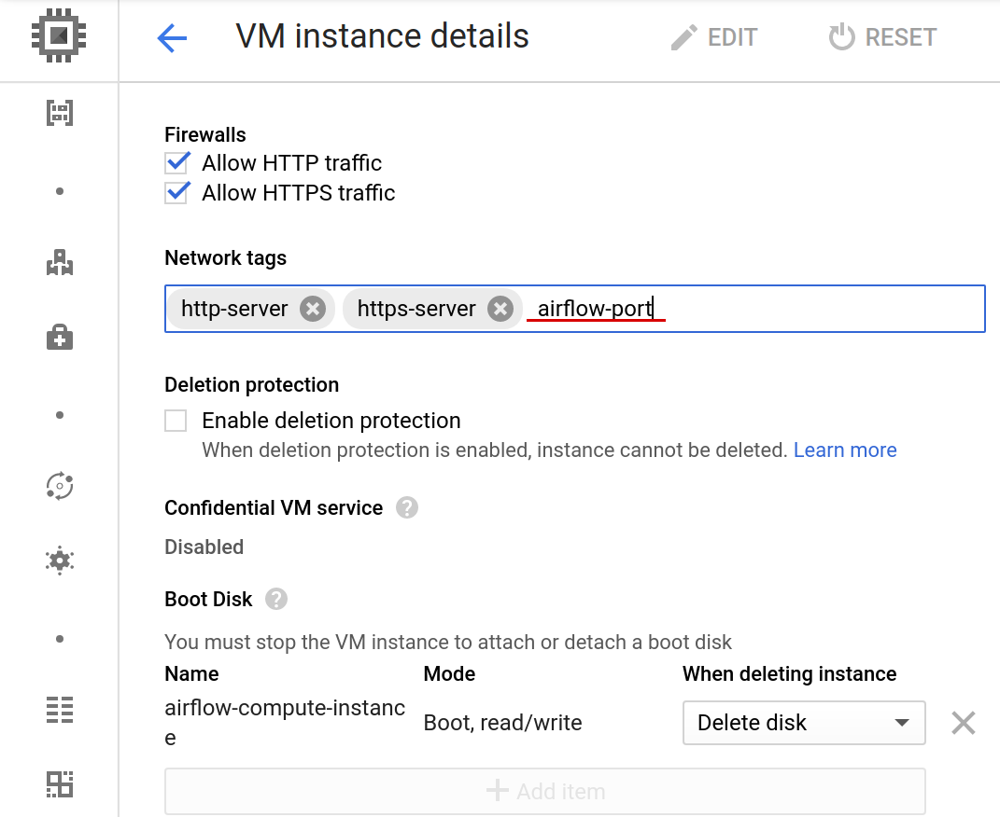

### 7. First execution of Airflow

Go back to the terminal and start the Web Server

```bash
airflow webserver -p 8080
```

Open another terminal and start the Scheduler

```bash
airflow scheduler
```

Go to your Google Cloud Console and copy the external IP to your clipboard.

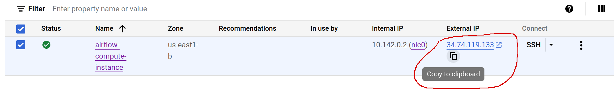
Finally, on your browser go to http://COMPUTE-ENGINE-IP:8080 and login with the user and password you have created when the DB was initialized.

Our Airflow 2 instance should be running!

### 8. Next executions

For future executions, we want that our Airflow starts immediately after the Compute Engine start. Create a script in the _airflow/_ folder named `startup.sh`, and populate it with the following commands:

```bash
nano $HOME/airflow/startup.sh
```

```bash
#!/bin/bash

# Get this scripts folder
AIRFLOW_DIR=$(dirname $0)

# Load the environment variables
source ${AIRFLOW_DIR}/env.sh

# Stop any currently running Airflow processes
pkill airflow

# Start the scheduler and the webserver
nohup airflow scheduler >> scheduler.$(date -I).log &
nohup airflow webserver -p 8080 >> webserver.$(date -I).log &
```

Exit nano (**ctrl+x**, then **y**, then **enter**) and run the following command to make the script runnable (`chmod` stands for "change mode", and `+x` adds the "executable" mode to the file).

```bas
chmod +x $HOME/airflow/startup.sh
```

Now we can run that script to start Airflow.

```bash
$HOME/airflow/startup.sh
```

### 9. Set up access to GCP resources

```bash
nano ${HOME}/google-app-creds.json
```

From your local machine, paste the contents of your GCP key into this file.
